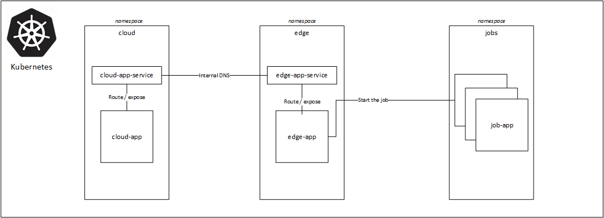

# Kubernetes for dummies

## [What is Kubernetes?](https://kubernetes.io/docs/concepts/overview/what-is-kubernetes/)

<p align="center">
    Kubernetes Components, source: https://kubernetes.io/docs/concepts/overview/components/
</p>

## Local Kubernetes installation
Choose one:
1. Install [Minikube](https://minikube.sigs.k8s.io/docs/start/)
1. Install [MicroK8s](https://microk8s.io/)

# Kubernetes crash course aka K8s for dummies (1 hour)

## Demo scenario description
In this tutorial we will use pre-built docker images published on Dockerhub to ease the job. For further details how to define and build docker images please see Docker documentation.

**You will learn**
- How to deploy application with several replicas and access it via Service.
- Deploy second service in a separated namespace and establish communication between two services.
- Establish communication between two service running in a separated namespaces (`cloud` and `edge`).
- Manually start jobs with Volume (ephemeral) storage na Persistent Volume storage claim.
- See how port-forwarding works in practice.
- Explore logs of the running pods.
- Assign resources requests (CPU, memory) to the pods.
- Control pod lifecycle using Kubernetes probes.


<p align="center">
    Kubernetes for dummies architecture diagram
</p>

Tools not mentioned in this tutorial, but recommended to study:
- [Helm](https://helm.sh/) as a Kubernetes package manager.
- [Helm Charts](https://helm.sh/docs/topics/charts/) to programatically desribe Kubernetes deployments. This is super useful, when you're running several services in K8s, or got multiple environments to operate. Generally it will make your life easier when managing K8s.
- [Terraform](https://www.terraform.io/) to configure underlying Kubernetes infrastructure, networking, but also RBAC.
- [RBAC (Role based access control)](https://kubernetes.io/docs/reference/access-authn-authz/rbac/) is useful to manage access right of a given applications running inside the cluster. For example, some applications might not be able to access apps from other namespace, or start the jobs, etc.
- [Kubernetes Dashboard](https://kubernetes.io/docs/tasks/access-application-cluster/web-ui-dashboard/) Kubernetes provides Web UI / Dashboard to see and troubleshoot apps running in the cluster.

### 1 Create namespaces
[Kubernetes supports multiple virtual clusters backed by the same physical cluster. These virtual clusters are called namespaces.](https://kubernetes.io/docs/concepts/overview/working-with-objects/namespaces/)

```
> kubectl create ns cloud
> kubectl create ns edge
> kubectl create ns jobs
```

List creates namespaces. Note that some "system" namespaces already did exist.
```
> kubectl get namespaces
```

### 2 Deploy first service Cloud APP
To better understand Kubernetes spec YAML files, I recommend reading through:
- [Understanding Kubernetes Objects](https://kubernetes.io/docs/concepts/overview/working-with-objects/kubernetes-objects/)
- [Deployment docs](https://kubernetes.io/docs/concepts/workloads/controllers/deployment/)
- [Deployment v1 apps API spec](https://kubernetes.io/docs/reference/generated/kubernetes-api/v1.19/#deployment-v1-apps)

Deployment of the app with 3 replicas together with a related Service.
```
> kubectl apply -f cloud-app/cloud-app-deployment.yaml
```

List pods to see, if app was deployed. _Note: see `-n` argument to list pods from a given namespace._
```
> kubectl get pods -n cloud

NAME                                    READY   STATUS              RESTARTS   AGE
cloud-app-deployment-76c4547875-7mxbr   0/1     ContainerCreating   0          81s
cloud-app-deployment-76c4547875-ftwml   0/1     ContainerCreating   0          81s
cloud-app-deployment-76c4547875-vvndf   0/1     ContainerCreating   0          81s

// After couple of minutes pods should be running
NAME                                    READY   STATUS    RESTARTS   AGE
cloud-app-deployment-76c4547875-7mxbr   1/1     Running   0          2m22s
cloud-app-deployment-76c4547875-ftwml   1/1     Running   0          2m22s
cloud-app-deployment-76c4547875-vvndf   1/1     Running   0          2m22s
```

See also deployed service `cloud-app-service`, which will be routing traffic to all 3 replicas of the `cloud-app` running. Service knows how to route traffic based on a correct selector (defined in the YAML file).
```
> kubectl get service -n cloud
NAME                TYPE        CLUSTER-IP     EXTERNAL-IP   PORT(S)    AGE
cloud-app-service   ClusterIP   10.100.132.0   <none>        5000/TCP   19h
```

See, if we can communicate with the deployed app in the Kubernetes cluster. To do that, we need to access `cloud-app` related service named `cloud-app-service`. To do that, we can use port forwarding feature of the Kubernetes.
Port forwarding docs: https://kubernetes.io/docs/tasks/access-application-cluster/port-forward-access-application-cluster/
```
> kubectl port-forward service/cloud-app-service 5000:5000 -n cloud

// Now, you can request the service and get the correct response.
>  curl http://localhost:5000/
Hello, World!
```

Bonus: there is an option to expose [running service publicly](https://kubernetes.io/docs/tutorials/kubernetes-basics/expose/expose-intro/). For purposes of this tutorial we will skip this setup.

### 3 Deploy second service Edge APP
Edge app will be deployed in the separated namespace `edge` and communication between `cloud-app` and `edge-app` across namespaces will be established.

Deploy the application and service
```
> kubectl apply -f edge-app/edge-app-deployment.yaml
```

List pods to see, if app was deployed. _Note: see `-n` argument to list pods from a given namespace._
```
> kubectl get pods -n edge

NAME                                   READY   STATUS              RESTARTS   AGE
edge-app-deployment-6f7bc44796-98ndm   0/1     ContainerCreating   0          9s
edge-app-deployment-6f7bc44796-d7t9f   0/1     ContainerCreating   0          9s
edge-app-deployment-6f7bc44796-s5klz   0/1     ContainerCreating   0          9s

// After couple of minutes pods should be running
NAME                                   READY   STATUS    RESTARTS   AGE
edge-app-deployment-6f7bc44796-98ndm   1/1     Running   0          114s
edge-app-deployment-6f7bc44796-d7t9f   1/1     Running   0          114s
edge-app-deployment-6f7bc44796-s5klz   1/1     Running   0          114s
```

We will not expose or port-forward `edge-app`, because it can be accessed via `cloud-app`. Let's see how that works.

### 4 Establishing communication between two services across namespaces
Port forwarding docs: https://kubernetes.io/docs/tasks/access-application-cluster/port-forward-access-application-cluster/

First, let's expose `cloud-app`, so we can query it directly
```
> kubectl port-forward service/cloud-app-service 5000:5000 -n cloud

> curl http://localhost:5000/
Hello, World!
```
Port-forwarding seems to be working just fine.

Now, let's try to query `edge-app` via `cloud-app` by requesting `/edge` endpoint.
```
> curl http://localhost:5000/edge/stateless
Starting stateless job
```

Notice that `EDGE_API_URL` environment variable needs to be correctly set to the `'http://edge-app-service.edge.svc.cluster.local:5000/job'` which is Kubernetes internal DNS resolution of the `edge-app-service` running in the `edge` namespace. If this variable was incorrectly set, communication between services would not work.

### 5 Start a stateless Job with Ephemeral storage and see how it works
Volumes docs: https://kubernetes.io/docs/concepts/storage/volumes/

Start the stateless job (could be any stateless application, e.g. data processing task, API, etc.)
```
> kubectl create -f ./job-app-manual.yaml
job.batch/job-app-hhxf4 created
```

Now list the pods within the namespace and copy newly created pod name to obtain logs.
```
> kubectl logs -f job-app-hhxf4-4sfw4 -n jobs
Working hard on stateless
Before disk write: []
After disk write: ['9227465.txt']
```
As you can see, attached disk location (`/mnt/storage`) was empty, but file could be written on disk. Any files written on an ephemeral storage lives there only during lifetime of the pod.

Let's try to run the same job again and see whether disk location is empty.
```
> kubectl create -f ./job-app-manual.yaml
job.batch/job-app-z4gdr created

> kubectl logs -f job-app-z4gdr-tjbkf -n jobs
Working hard on stateless
Before disk write: []
After disk write: ['9227465.txt']
```
Disk location was empty as expected. To preserve files saved on a disk location we need to use Persistent Volumes, which are described below.

### 6 Start a stateful Job with Persistent Volume claim disk attached
Persistent Volumes docs: https://kubernetes.io/docs/concepts/storage/persistent-volumes/

Start job with a Persistent Volume claim
```
> kubectl create -f ./job-app-manual-persistent.yaml

// See the logs
> kubectl logs -f job-app-c2d5r-vgvd6 -n jobs
Working hard on stateful
Before disk write: []
After disk write: ['35.txt']
```

Start the same job again. Now, the calculated number will be loaded from a persistent disk.
```
> kubectl create -f ./job-app-manual-persistent.yaml

// See the logs
> kubectl logs -f job-app-25ztg-2b6gp -n jobs
Working hard on stateful
Before disk write: ['35.txt']
Reading pre-calculated fib number from file /mnt/storage/35.txt
```

### 7 Start jobs programatically using Cloud APP
Kubernetes provides API, which can be controlled by any progamming language. For major language like Java, Python, C#, Go., etc. there are client libraries. For python see https://github.com/kubernetes-client/python

To see how it can be implemented see source code of the `edge-app/edge-app.py`. To actually start for example K8s job from python code, call Cloud APP API doing this job
```
> curl http://localhost:5000/edge/stateless/fib_n/35
```
Or you can start a `stateful` job as well.


## Recommended best practices
### 1 Resources management
> "By default, containers run with unbounded compute resources on a Kubernetes cluster."

It is recommended to set resources requests and limits. To do that:
1. Set namespace Resource Quotas, e.g. how much CPU and memory namespace will be provided with. For more details see docs: https://kubernetes.io/docs/concepts/policy/resource-quotas/
1. Set Limit Range for a given namespace. This will set minimum and maximum resources (CPU, memory) which can be requested by a single pod or container. For more details see docs: https://kubernetes.io/docs/concepts/policy/limit-range/
1. Request resources by a Pod or Container. See docs for more details: https://kubernetes.io/docs/concepts/configuration/manage-resources-containers/. 
   
Example of Resource requests can be seen in `job-app` YAML files.

### 2 Pods lifecycle management
Each pod has it's own lifecycle. Some application might start running immediately, some might require few seconds or minutes to start. Kubernetes provides mechanism to monitor lifecycle of such applications. Three so called probes are provided by Kubernetes API: Liveness, Readiness and Startup Probes.
1. [Liveness probe](https://kubernetes.io/docs/tasks/configure-pod-container/configure-liveness-readiness-startup-probes/#define-a-liveness-command) periodically checks, if application is running and is healthy. I recommend setting this probe for each long-running apllication, e.g. API. Some applications might get stuck, there could be errors, memory leaks, etc. causing to break your services or system.
1. [Readiness probe](https://kubernetes.io/docs/tasks/configure-pod-container/configure-liveness-readiness-startup-probes/#define-readiness-probes) Sometimes, applications are temporarily unable to serve traffic. For example, an application might need to load large data or configuration files during startup, or depend on external services after startup. In such cases, you don't want to kill the application, but you don't want to send it requests either. Kubernetes provides readiness probes to detect and mitigate these situations. A pod with containers reporting that they are not ready does not receive traffic through Kubernetes Services.
1. [Startup probe](https://kubernetes.io/docs/tasks/configure-pod-container/configure-liveness-readiness-startup-probes/#define-startup-probes) could be used for slow-starting applications.

Example of Liveness probe and Readiness probe can be seen in the `cloud-app` YAML file.

### 3 External load balancers
External load balancers can be easily setup within the cluster. It is supported by most of the major public cloud providers. For more info see docs: https://kubernetes.io/docs/concepts/services-networking/service/#loadbalancer

### 4 ConfigMaps and Secrets
- When more complex, or a better controlled (compared to environment variables) configuration is required, ConfigMaps can be used. Added value of ConfigMap is that it can be named and versioned in for instance Helm Charts, but also decoupling configuration from deployment spec. See documentation: https://kubernetes.io/docs/tasks/configure-pod-container/configure-pod-configmap/
- If application running in Kubernetes needs to access sensitive information like a database login/password, it is good practice to not store/pass such information as environment variable or a config map. Kubernetes Secrets concept was create exactly for this case. Documentation on Kubernetes Secrets: https://kubernetes.io/docs/concepts/configuration/secret/

### 5 Rolling updates and Rollbacks
Kubernetes is a great tool for safe updates of the applications running in it. It also provides great interface for performing rollbacks, if something goes wrong.
- Rolling updates are set by default, meaning that new replica will be started, while old replica killed only when new replica is ready (Readiness probe). This can be indeed configured, see docs: https://kubernetes.io/docs/concepts/workloads/controllers/deployment/#rolling-update-deployment
- Rollback can be performed by a single command, docs: https://kubernetes.io/docs/concepts/workloads/controllers/deployment/#rolling-back-a-deployment. Note: it is recommended to follow versioning of the docker image used in each release and also add `--record` argument to keep [history of deployment commands](https://kubernetes.io/docs/concepts/workloads/controllers/deployment/#creating-a-deployment).

### 6 See logs and execute into container
Docs: https://kubernetes.io/docs/reference/kubectl/cheatsheet/#interacting-with-running-pods

See logs:
```
> kubectl logs -f <pod name>
```

Execute into the running pod and start bash
```
> kubectl exec -it <copy pod name here> -n cloud -- /bin/bash
```

### 7 Kubernetes failures from the wild
[Kubernetes Failure Stories](https://k8s.af/)